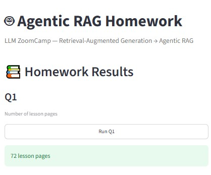
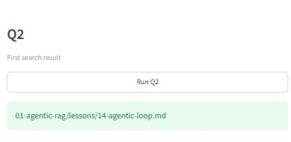
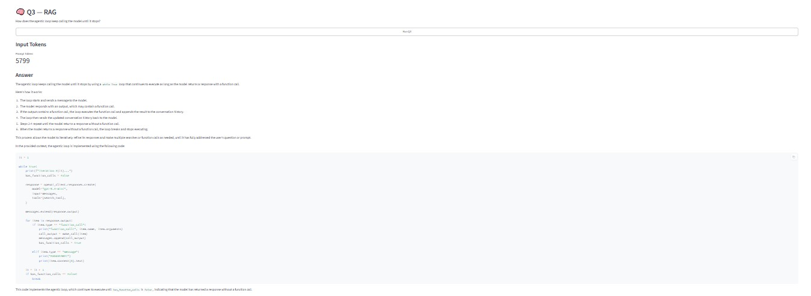
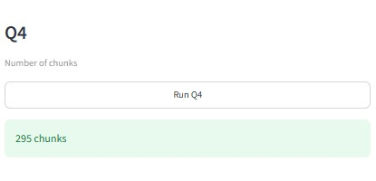
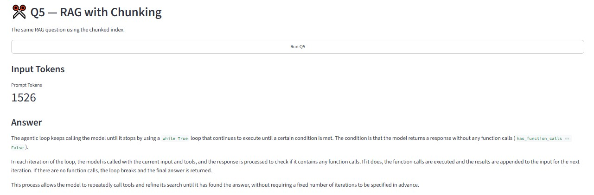
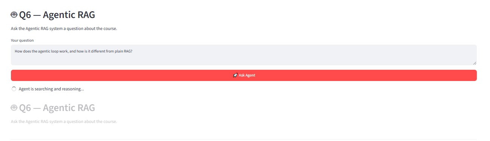
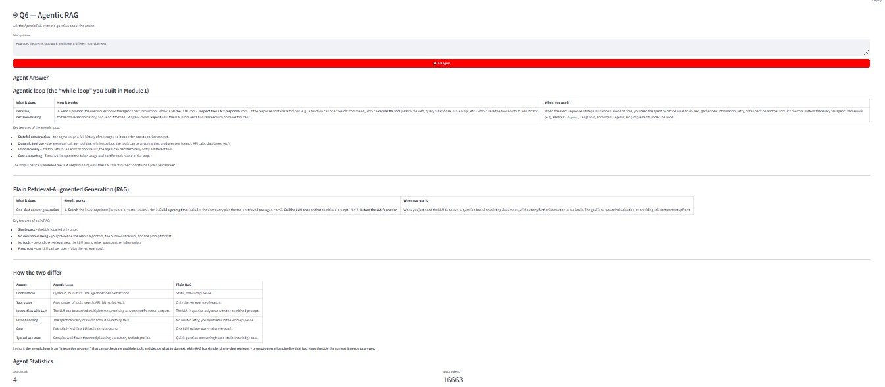

# 🤖 Agentic RAG — LLM ZoomCamp Homework

An implementation of the **Agentic RAG homework** from the [DataTalks.Club LLM ZoomCamp](https://github.com/DataTalksClub/llm-zoomcamp).

The project demonstrates the evolution from a traditional Retrieval-Augmented Generation (RAG) pipeline into an **Agentic RAG system**, where an LLM can decide when to search, call a retrieval tool, inspect the results, and continue iterating until it can produce a final answer.

The project also includes a **Streamlit UI** for running and demonstrating all homework questions from **Q1 to Q6**.

---

## 📌 Project Overview

The project follows the progression introduced in the Agentic RAG lessons:

```text
Course Lessons
      │
      ▼
Document Loading
      │
      ▼
Search / Retrieval
      │
      ▼
Plain RAG
      │
      ▼
Document Chunking
      │
      ▼
RAG with Chunking
      │
      ▼
Search as a Tool
      │
      ▼
Agentic Loop
      │
      ▼
Agentic RAG
      │
      ▼
Streamlit UI
```

The main objective is to understand the difference between:

- **Plain RAG** — a fixed retrieve-then-generate pipeline.
- **Agentic RAG** — an LLM-driven workflow where the model can dynamically decide when to use a search tool and can perform multiple retrieval iterations.

---

# ✨ Features

- 📚 Load course lesson documents from the LLM ZoomCamp repository.
- 🔎 Search lesson content using MinSearch.
- 🧩 Split documents into overlapping chunks.
- 🧠 Implement traditional RAG.
- 🧠 Implement RAG using document chunks.
- 🛠️ Expose search as an LLM tool.
- 🔄 Implement an agentic loop.
- 🤖 Allow the LLM to perform multiple searches before answering.
- 📊 Track search calls and token usage.
- 🖥️ Provide a Streamlit UI for Q1–Q6.
- 🔐 Keep API credentials outside the repository using `.env`.
- 📦 Manage dependencies using `uv`.

---

# 🛠️ Technologies

| Technology | Purpose |
|---|---|
| Python | Main programming language |
| uv | Python environment and dependency management |
| Streamlit | Web-based UI |
| Groq | LLM API |
| OpenAI-compatible API | Model communication |
| ToyAIKit | Agent/tool-calling workflow |
| MinSearch | Search and retrieval |
| GitSource | Document chunking |
| python-dotenv | Environment variable management |

---

# 📋 Requirements

Before running the project, make sure you have:

- Python 3.11+
- [uv](https://docs.astral.sh/uv/)
- A Groq API key
- Git

---

# 🚀 Installation

## 1. Clone the repository

```bash
git clone https://github.com/AndrewSameh7/LLM-ZoomCamp-Agentic-RAG-Homework.git
cd LLM-ZoomCamp-Agentic-RAG-Homework
```

## 2. Install dependencies

```bash
uv sync
```

This creates and synchronizes the project environment using the dependencies defined in `pyproject.toml` and locked in `uv.lock`.

---

# 🔑 Environment Variables

Create a `.env` file in the project root:

```env
GROQ_API_KEY=your_groq_api_key
```

The application loads the API key using `python-dotenv`.

### 🔐 Security

The `.env` file is excluded from Git using `.gitignore`.

Never commit your API key or any other credentials to the repository.

The virtual environment `.venv` is also excluded from Git.

---

# 📁 Project Structure

```text
LLM-ZoomCamp-Agentic-RAG-Homework/
│
├── q1.py
├── q2.py
├── q3.py
├── q4.py
├── q5.py
├── q6.py
│
├── src/
│   └── agentic_rag/
│       ├── __init__.py
│       ├── data_loader.py
│       ├── search.py
│       ├── chunking.py
│       └── rag.py
│
├── ui/
│   └── app.py
│
├── docs/
│   ├── screenshots/
│   │   ├── q1.png
│   │   ├── q2.png
│   │   ├── q3.png
│   │   ├── q4.png
│   │   ├── q5.png
│   │   └── q6.png
│   │
│   └── demo/
│       └── agentic-rag-demo.mp4
│
├── pyproject.toml
├── uv.lock
├── .python-version
├── .gitignore
└── README.md
```

---

# 🧩 Main Modules

## `data_loader.py`

Loads Markdown lesson files from the DataTalksClub LLM ZoomCamp repository using a fixed commit and prepares them as searchable documents.

---

## `search.py`

Builds MinSearch indexes for:

- Original lesson documents.
- Chunked lesson documents.

These indexes are used by the RAG and Agentic RAG workflows.

---

## `chunking.py`

Splits lesson documents into overlapping chunks using:

```python
gitsource.chunk_documents
```

Current configuration:

```text
Chunk size: 2000
Step:       1000
```

This allows retrieval to operate on smaller and more focused pieces of the original lessons.

---

## `rag.py`

Contains the reusable RAG implementation:

1. Search the index.
2. Retrieve relevant documents.
3. Build the context.
4. Construct the prompt.
5. Send the prompt to the LLM.
6. Return the generated answer and token usage.

---

## `q1.py` → `q6.py`

Contain the individual homework tasks and experiments.

Each file corresponds to one of the required homework questions.

---

## `ui/app.py`

Provides the Streamlit interface for running and displaying:

- Q1 — Lesson pages
- Q2 — Search
- Q3 — Basic RAG
- Q4 — Chunking
- Q5 — RAG with chunking
- Q6 — Agentic RAG

The Q6 section also displays execution statistics such as search calls and token usage.

---

# 📝 Homework Results

## Q1 — Total Lesson Pages

The lesson repository contains:

```text
72 lesson pages
```

### Result

**72**

---

# 🔎 Q2 — Search Query

The search query was designed to find information about the agentic loop.

The first relevant search result was:

```text
01-agentic-rag/lessons/14-agentic-loop.md
```

### Result

```text
01-agentic-rag/lessons/14-agentic-loop.md
```

---

# 🧠 Q3 — Basic RAG

Q3 demonstrates the traditional RAG workflow.

```text
User Question
      │
      ▼
Search Index
      │
      ▼
Retrieved Documents
      │
      ▼
Build Context
      │
      ▼
Prompt + Context
      │
      ▼
LLM
      │
      ▼
Answer
```

The important concept is that retrieval is performed by the application before the LLM generates the answer.

The LLM receives the retrieved information as context.

### Tested Result

The implementation successfully produced an answer explaining the agentic loop and its `while True` control flow.

### Input Tokens

```text
5799
```

> Token usage can vary depending on the model and request.

---

# 🧩 Q4 — Document Chunking

Q4 introduces document chunking.

The lesson documents are split into overlapping chunks.

### Configuration

```text
Chunk size: 2000
Step:       1000
```

### Result

```text
295 chunks
```

Chunking allows the retrieval system to work with smaller and more relevant sections of the lessons instead of retrieving complete documents.

---

# 🧠 Q5 — RAG with Chunking

Q5 uses the chunked document index instead of the original lesson index.

```text
Question
   │
   ▼
Chunked Search Index
   │
   ▼
Relevant Chunks
   │
   ▼
Context
   │
   ▼
LLM
   │
   ▼
Answer
```

The implementation successfully answered the agentic-loop question using the chunked index.

### Recorded Input Tokens

```text
1526
```

> The exact token count can vary between executions.

---

# 🤖 Q6 — Agentic RAG

Q6 changes the architecture from a fixed RAG pipeline into an agentic workflow.

Instead of always performing:

```text
Search → Build Context → LLM → Answer
```

the LLM receives a search tool and can decide whether it needs additional information.

The workflow becomes:

```text
             ┌───────────────────┐
             │       User        │
             └─────────┬─────────┘
                       │
                       ▼
             ┌───────────────────┐
             │        LLM        │
             └─────────┬─────────┘
                       │
                Need more info?
                  ┌────┴────┐
                 Yes        No
                  │          │
                  ▼          ▼
          ┌────────────┐  ┌────────────┐
          │   Search   │  │   Final    │
          │    Tool    │  │   Answer   │
          └──────┬─────┘  └────────────┘
                 │
                 ▼
           Tool Result
                 │
                 ▼
                LLM
                 │
                 └─────── loop ───────►
```

The agent can perform multiple searches using different queries before producing its final response.

---

# 🛠️ Search Tool

The search function is registered with ToyAIKit as a tool.

Conceptually:

```python
def search(query: str) -> list[dict]:
    """
    Search the course lessons for relevant information.
    """
    return index.search(
        query,
        num_results=3,
    )
```

The important difference is that search is no longer a hard-coded step in the pipeline.

Instead, it becomes an action available to the LLM.

---

# 🔄 Agentic Loop

The agentic loop follows these steps:

1. Send the conversation and available tools to the LLM.
2. Check whether the LLM requested a tool call.
3. If a search was requested, execute the search.
4. Add the search results to the conversation.
5. Send the updated context back to the LLM.
6. Repeat if another tool call is requested.
7. Stop when the LLM returns a final answer.
8. Return the final response.

This represents the core idea behind an agentic workflow.

ToyAIKit handles the repetitive tool-call and message-management logic.

---

# ⚖️ Plain RAG vs Agentic RAG

| Feature | Plain RAG | Agentic RAG |
|---|---|---|
| Control flow | Fixed | Dynamic |
| Retrieval | Application-controlled | LLM-controlled |
| Tool calls | Usually one fixed retrieval step | Can perform multiple calls |
| Iteration | Usually single-pass | Iterative |
| Decision making | Hard-coded | LLM-driven |
| Best for | Simple Q&A | Multi-step / adaptive tasks |

### In short

**Plain RAG** follows a fixed retrieve-then-generate pipeline.

**Agentic RAG** allows the LLM to control the retrieval process through tools and an iterative loop.

---

# 📊 Q6 Tested Result

The final Agentic RAG workflow successfully answered:

> How does the agentic loop work, and how is it different from plain RAG?

The tested run demonstrated multiple search calls before producing the final answer.

Example recorded statistics:

```text
Search calls: 4
Input tokens: 16663
```

Token usage and the number of search calls may vary between runs because the agent dynamically decides how much information it needs.

---

# 🖥️ Streamlit UI

The project includes a Streamlit interface for demonstrating the complete homework.

Run:

```bash
uv run streamlit run ui/app.py
```

Then open:

```text
http://localhost:8501
```

The interface provides sections for:

- Q1 — Lesson Pages
- Q2 — Search Result
- Q3 — Basic RAG
- Q4 — Chunking
- Q5 — RAG with Chunking
- Q6 — Agentic RAG

The Q6 interface also displays useful execution information such as:

- Agent answer
- Number of search calls
- Token usage

---

# 📸 Screenshots

The project UI can be demonstrated through the following screenshots.

## UI Overview


## Q1 — Lesson Pages



## Q2 — Search



## Q3 — Basic RAG



## Q4 — Chunking



## Q5 — RAG with Chunking



## Q6 — Agentic RAG




> Screenshots will be added to `assets/`.

---

# 🎥 Demo

A short screen recording demonstrating the Streamlit Agentic RAG application will be added here.

### Agentic RAG Demo

[▶️ Watch the Demo](docs/demo/agentic-rag-demo.mp4)

The demo shows:

1. Launching the Streamlit application.
2. Running the homework sections.
3. Asking an Agentic RAG question.
4. The agent performing searches.
5. The final generated answer.
6. Search-call and token statistics.

> The demo video will be added to `docs/demo/`.

---

# ▶️ Running the Homework

Individual questions can be executed from the terminal:

```bash
uv run python q1.py
```

```bash
uv run python q2.py
```

```bash
uv run python q3.py
```

```bash
uv run python q4.py
```

```bash
uv run python q5.py
```

```bash
uv run python q6.py
```

---

# 🖥️ Running the Complete UI

Start Streamlit with:

```bash
uv run streamlit run ui/app.py
```

Then open:

```text
http://localhost:8501
```

---

# 📦 Dependencies

Dependencies are defined in:

```text
pyproject.toml
```

and locked in:

```text
uv.lock
```

To reproduce the project environment:

```bash
uv sync
```

---

# 🔐 Security

The project uses a `.env` file for API credentials.

Example:

```env
GROQ_API_KEY=your_groq_api_key
```

The following files/directories are intentionally excluded from Git:

```text
.env
.venv/
```

No API credentials should ever be committed to the repository.

---

# 🎯 Learning Outcomes

This project demonstrates practical understanding of:

- Retrieval-Augmented Generation (RAG)
- Search and retrieval
- Document indexing
- Document chunking
- Context construction
- LLM prompting
- Tool calling
- Agentic workflows
- Agent loops
- Iterative search
- Token usage tracking
- Building an Agentic RAG application
- Building a Streamlit interface

The overall progression is:

```text
RAG
  ↓
Better Retrieval
  ↓
Document Chunking
  ↓
RAG with Chunks
  ↓
Search as a Tool
  ↓
Agentic Loop
  ↓
Agentic RAG Application
```

---

# 📌 Notes

- The project uses a fixed commit of the course repository for reproducible lesson loading.
- Agentic RAG responses may vary between runs.
- Token usage may vary depending on the number of agent iterations and tool calls.
- The number of search calls may also vary.
- ToyAIKit is used as a teaching and experimentation library for the agent loop.
- This project is an educational implementation of the LLM ZoomCamp homework and is not intended to be a production-ready Agentic RAG system.

---

# 👤 Author

**Andrew Sameh**

LLM ZoomCamp — Agentic RAG Homework

Built as part of the **DataTalks.Club LLM ZoomCamp Internship**.

---

## ⭐ Project

If you find this project useful, feel free to explore the implementation and the individual homework questions.
